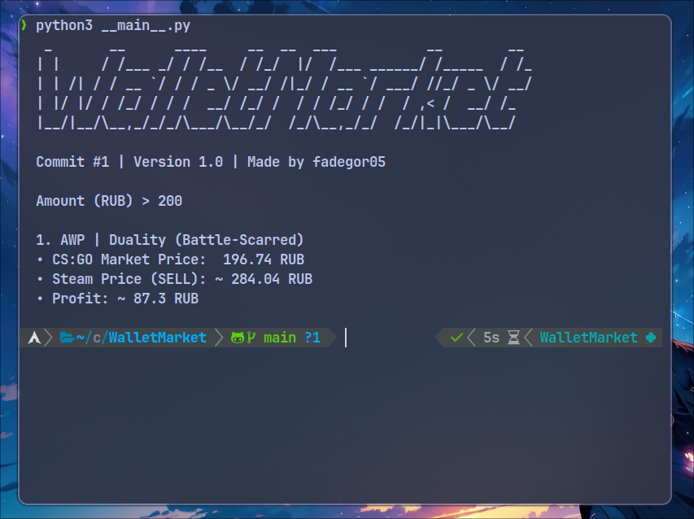

# WalletMarket

Python console app which can be useful in case of searching the most valuable skin option on <b>CSGOMarket</b> for your <b>Steam</b> account.

Be careful, it's a just-for-fun project and not thoroughly tested. No guaranty or warranty for anything.

# Config

Here you can edit currency that you want to use (now supports only RUB, USD, EUR), also you can configure delta with amount of money and item price
```
{
    "currency": "RUB", 
    "delta": 0.05
}
```
# TODO
- Add currencies from <a href="https://en.wikipedia.org/wiki/ISO_4217#Active_codes">ISO 4217</a>
- Make algorithm of get the Steam price  more accurate
- Add auto-buy on MarketCSGO
- Add auto-sell on Steam
- Add link for the item in MarketCSGO and Steam


# Requirements

- requests

# Install

```
pip install requests
```